# terraform-example-iam-identity-account-pattern
Example of AWS identity account pattern.

The identity account pattern is one of design pattern of multiple AWS accounts. Users logs in to only single account called 'Identity account' and use assume role (switch role) api to access other accounts.

This pattern has two types of policy attachment strategy. One is `IAM user direct attach pattern` which attaches IAM policy directry to IAM user. Another is `IAM group attach pattern` which attaches IAM policy to IAM Group and all IAM users belong to them.

## IAM user direct attach pattern

## IAM group attach pattern

